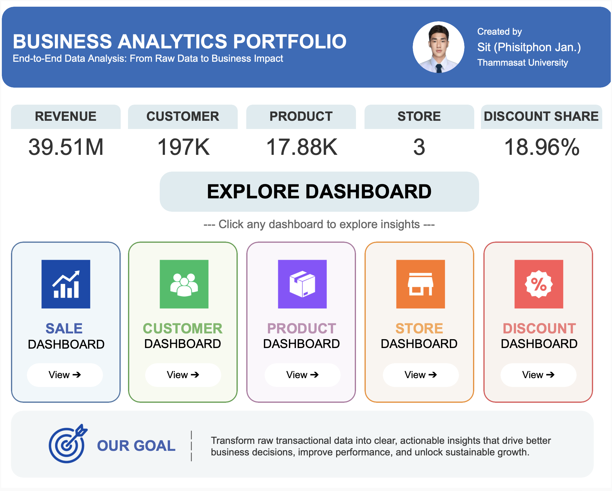

# Insight Flow – Retail Analytics & Decision Support System

## Project Overview
This project transforms high-volume and inconsistent retail transaction data into reliable business insights through an end-to-end analytics workflow using SQL, Python, SQLite, and Tableau.

The analysis focuses on identifying key revenue drivers across sales, customer behavior, product performance, store operations, basket size, and discount effectiveness to support data-driven decision-making.

## Dataset Overview
- 1.06M transaction records before cleaning
- 196K customers
- 17K products
- 3 stores
- 624K orders


## Business Objective
The objective of this project is to identify revenue drivers and performance improvement opportunities across multiple retail dimensions, including pricing, customers, products, stores, and discounts.

## Key Challenges
The raw dataset contained several data quality issues that could affect analytical reliability:

- Missing and inconsistently formatted values
- Duplicate transaction records
- Misaligned identifiers across tables
- Invalid numeric values
- Revenue inconsistencies caused by duplicated and dirty records

## Workflow
1. Exploratory Data Analysis with SQL
2. Data Cleaning and Validation
3. Relational Data Modeling in SQLite
4. Feature Engineering with Python
5. Sales, Customer, Product, Store, and Discount Analysis
6. Tableau Dashboard Development
7. Business Insight and Recommendation

## Tools & Technologies
- SQL / SQLite
- Python: pandas, matplotlib, seaborn
- Tableau
- Data Cleaning
- Exploratory Data Analysis
- RFM Segmentation
- CLV Analysis
- Business Dashboard Design

## Data Cleaning Summary
| Metric | Before | After |
|---|---:|---:|
| Total Rows | 1.06M | 0.90M |
| Missing Values in Core Fields | ~8–9% | ~0% |
| Duplicate Records | ~10K+ removed | ~0 exact duplicates |
| Total Revenue | 42.67M | 39.50M |

## Key Analysis Areas
### Sales Analysis
- Monthly and quarterly revenue trends
- Average order value
- Revenue driver correlation
- Weekday vs weekend performance

### Customer Analysis
- Customer segmentation
- RFM analysis
- Cohort retention analysis
- Customer lifetime value analysis

### Product Analysis
- Product and category performance
- Gross profit and margin analysis
- Return rate analysis
- ABC product classification

### Store Analysis
- Store revenue and profitability
- Revenue per employee
- Store-level return and discount analysis
- Country and city performance

### Discount Analysis
- Campaign and non-campaign discount performance
- Discount impact on revenue and gross profit
- High-discount and low-margin product identification

## Key Insights
- Revenue showed high volatility, suggesting reliance on seasonal demand rather than stable growth.
- High-value “Champion” customers contributed strongly to revenue, creating potential dependency risk.
- Small basket sizes dominated transactions, indicating cross-selling opportunities.
- Feminine and Masculine categories drove most revenue, while Children products contributed significantly less.
- Discount strategies required optimization to balance revenue growth and margin protection.

## Business Recommendations
- Prioritize retention strategies for high-value customers.
- Introduce bundle promotions to increase basket size and average order value.
- Optimize discount strategies to protect margins.
- Invest in underperforming product categories to diversify revenue streams.
- Use dashboards as decision-support tools for ongoing performance monitoring.

## Interactive Dashboard

The final dashboard was published on Tableau Public to allow users to explore revenue, customer, product, store, and discount performance interactively.

[View Interactive Tableau Dashboard](https://public.tableau.com/app/profile/phisitphon.jantharakittikun/viz/BusinessPerformanceDashboardRetailCaseStudy/HOME)

## Dashboard Preview


## Project Structure

```text
insight-flow-retail-analytics/
│
├── README.md
├── requirements.txt
├── .gitignore
│
├── sql/
│   ├── 01_eda_before_cleaning.sql
│   └── 02_data_cleaning.sql
│
├── src/
│   └── retail_analysis.py
│
├── images/
│   └── dashboard_overview.png
│
├── tableau/
│   └── BusinessPerformanceDashboard.twb
│
└── reports/
    └── project_case_study.pdf
```


## How to Run

This repository contains the SQL scripts, Python analysis workflow, dashboard file, and project documentation.  
The full database is not included due to file size and data privacy considerations.

To run the Python analysis locally, prepare a SQLite database with the required tables and update the database path in `src/retail_analysis.py`.

```bash
pip install -r requirements.txt
python src/retail_analysis.py
```

## Note
The full dataset and SQLite database are not included in this repository due to file size and data privacy considerations. Dashboard screenshots and documentation are provided for portfolio demonstration purposes.
